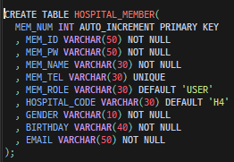

# 🏥 SNS를 활용한 병원 로그인 및 회원가입

## 목차

* 회원가입
* 로그인
* **SNS**를 통한 회원가입

### 회원가입

일반 회원가입과 **SNS**를 통한 회원가입 2가지의 기능을 만들었습니다.
먼저 일반회원가입입니다.

회원에 대한 기초정보를 입력합니다. 

입력한 기초정보를 가지고 회원가입 페이지를 구현합니다. 
나머지 정보를 입력한 후에 회원가입이 진행됩니다.

### 로그인

회원가입시 입력한 정보들로 데이터베이스에서 조회하여 로그인기능을 처리합니다.

로그인이 완료되게되면 회원가입시 작성한 이름으로 표시가 됩니다. 

회원가입 및 로그인 관련 데이터 베이스 입니다. 

### SNS를 통한 회원가입
