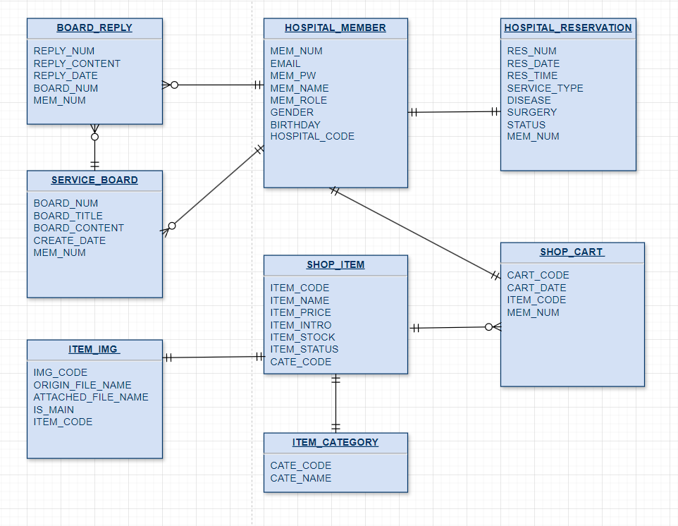
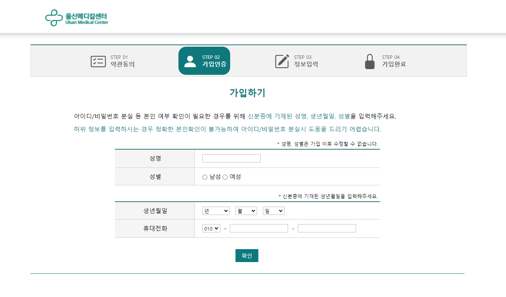
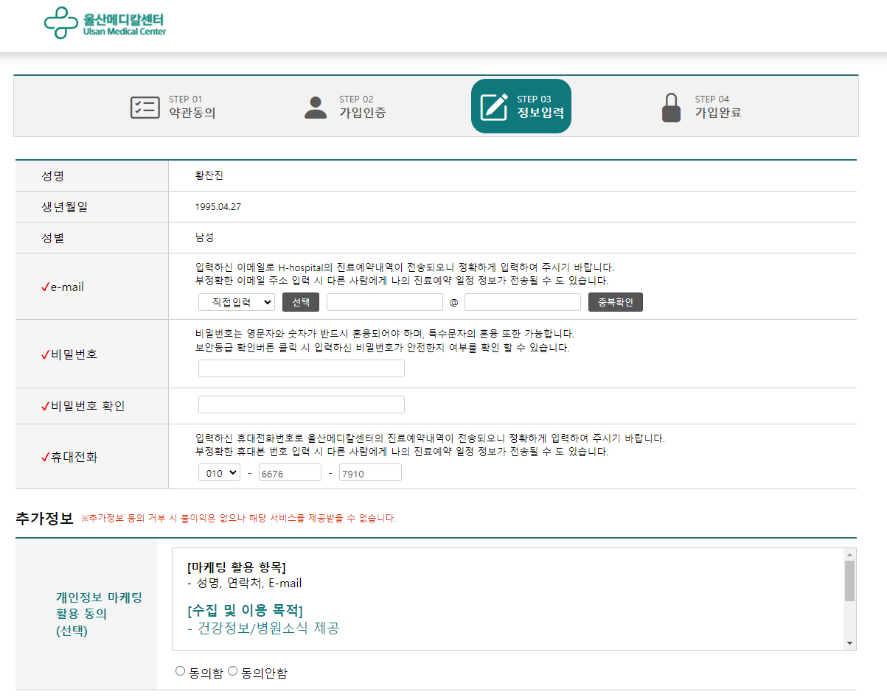
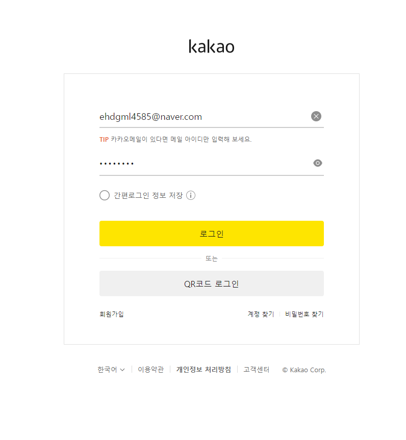
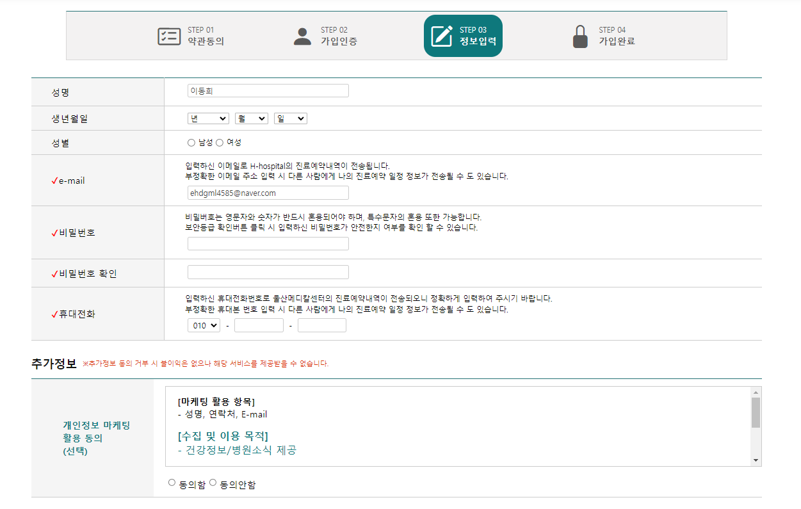
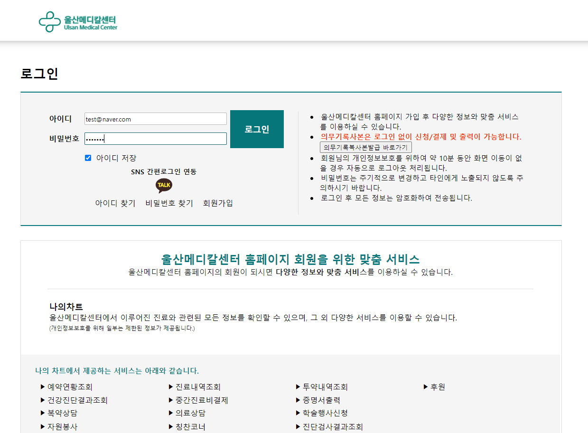
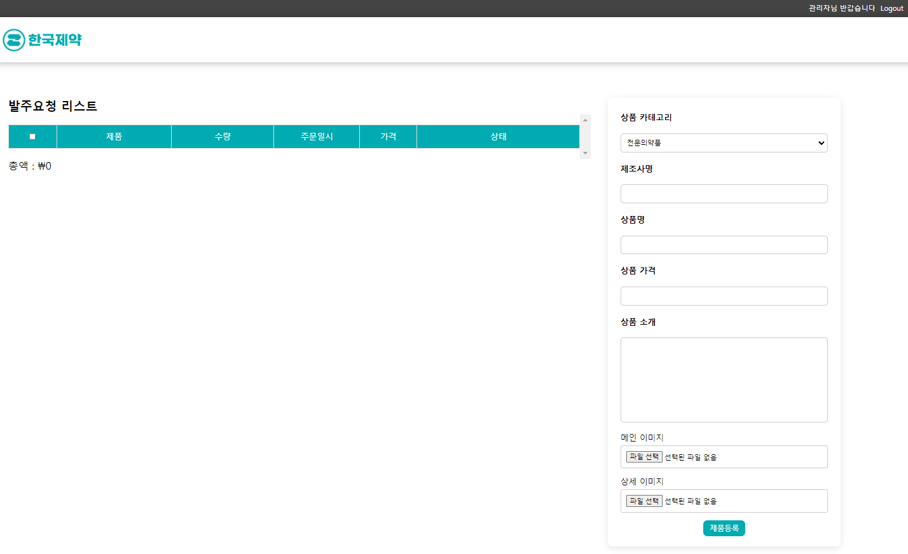
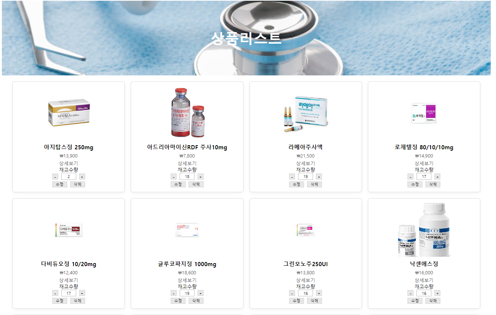

# 팀 도와조_울산메디컬센터

## 📄프로젝트 소개

- 일반 고객과 직원의 데이터를 분류해 웹 페이지 사용을 편리하게 하도록 하고, 카카오api를 활용해 회원가입을 쉽게 할 수 있도록 함
- 병원 발주 프로그램과 공급사의 수주 프로그램을 구현해 의료 용품 재고관리를 용이하게 하고자 함

# 프로젝트 목차

## SNS를 활용한 병원 로그인 및 회원가입
#### 회원가입
- 일반 회원가입
- SNS를 통한 회원가입

#### 로그인
- 일반 로그인
- SNS를 통한 로그인

## 의료용품 수주/발주 프로그램
#### 병원 관점 의료용품 발주 프로그램

#### 공급사 관점 의료용품 수주 프로그램

## 😎팀원 소개😆
<table>
  <tbody>
    <tr>
      <td align="center"></td>
      <td align="center"></td>
      <td align="center"></td>
      <td align="center"></td>
    </tr>
    <tr>
      <td align="center">
        황찬진 
        <a href="https://github.com/HCJIN">@HCJIN</a>
      </td>
      <td align="center">
        이동희 
        <a href="https://github.com/dlfjs4585">@dlfjs4585</a>
      </td>
      <td align="center">
        정보현 
        <a href="https://github.com/bohyeonjeong50">@bohyeonjeong50</a>
      </td>
      <td align="center">
        전하빈 
        <a href="https://github.com/kong2bine">@kong2bine</a>
      </td>
    </tr>
  </tbody>
</table>

## 🖥 기술 스택

### 백엔드

### 프론트엔드

### API

### 도구

### 데이터베이스 관계도

# 🏥 SNS를 활용한 병원 로그인 및 회원가입

## 목차

* 회원가입
* **SNS**를 통한 회원가입
* 로그인

## 회원가입

일반 회원가입과 **SNS**를 통한 회원가입 2가지의 기능을 만들었습니다.
먼저 일반회원가입입니다.

회원에 대한 기초정보를 입력합니다. 

입력한 기초정보를 가지고 회원가입 페이지를 구현합니다. 
나머지 정보를 입력한 후에 회원가입이 진행됩니다.

## SNS를 통한 회원가입

SNS(KAKAO) 회원가입 버튼을 누르게 되면 KAKAO 로그인 화면으로 넘어가게 됩니다.

KAKAO 로그인을 하며 로그인 성공 시 이름, email을 받아오게 되고, 나머지 정보를 입력한 후 회원가입이 진행됩니다.

## 로그인

일반 회원은 입력한 정보를 통해 데이터베이스에서 조회하여 로그인하고, SNS 회원은 KAKAO 로그인 아이콘을 클릭하면 KAKAO 로그인 화면으로 이동해, 로그인에 성공 시 해당 정보로 로그인 절차가 완료됩니다.

로그인이 완료되게되면 회원가입시 작성한 이름으로 표시가 됩니다. 

# 의료용품 수주/발주 프로그램

병원 측 관리자로 로그인 후 입고요청 페이지로 이동하게 되면 첫 화면입니다.

상품을 추가하게 되면 상품에 상태가 주문등록으로 등록되게 했고, 발주요청을 하게 되면 공급사 페이지에 상품과 함께 발주요청이 나오도록 만들었습니다.

짤 넣어야 할 것 같음

공급사 페이지의 첫 화면입니다.
기본적으로 발주요청을 받은 상품들을 확인 및 새로운 상품을 등록도 가능합니다.

발주요청을 받은 상품 출하를 누르게 되면 제품이 출하되었다는 말과 함께 상태가 제품 출하로 바뀌게 됩니다.

짤 넣으면 좋을 것 같음

# 🖊그 외 구현 기능

## 네이버 뉴스

홈페이지 메인의 하단에 출력되는 뉴스입니다.

새로고침 혹은 지정된 시간이 지난 후 새로운 뉴스로 갱신되도록 구현되었습니다.

## 진료과 찾기

## 진료 예약

