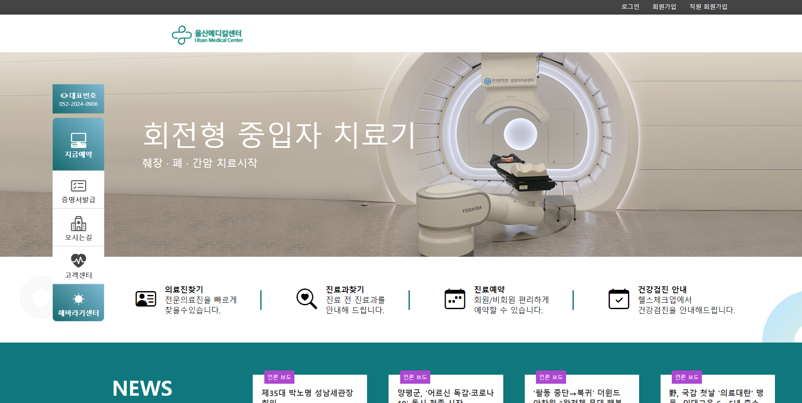
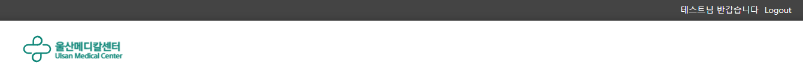

# 팀 도와조_울산메디컬센터

## 📄프로젝트 소개

- 일반 고객과 직원의 데이터를 분류해 웹 페이지 사용을 편리하게 하도록 하고, 카카오api를 활용해 회원가입을 쉽게 할 수 있도록 함
- 병원 발주 프로그램과 공급사의 수주 프로그램을 구현해 의료 용품 재고관리를 용이하게 하고자 함

# 프로젝트 목차

## SNS를 활용한 병원 로그인 및 회원가입
#### 회원가입
- 일반 회원가입
- SNS를 통한 회원가입

#### 로그인
- 일반 로그인
- SNS를 통한 로그인

## 의료용품 수주/발주 프로그램
#### 병원 관점 의료용품 발주 프로그램
- 의료용품 발주

#### 공급사 관점 의료용품 수주 프로그램
- 의료용품 등록
- 발주 요청 확인 후 출고 처리

## 의료용품 수주/발주 프로그램
#### 네이버 뉴스 
#### 
####

## 😎팀원 소개😆
<table>
  <tr>
    <td align="center">
      
    </td>
    <td align="center">
      
    </td>
    <td align="center">
      
    </td>
    <td align="center">
      
    </td>
  </tr>
      <tr>
      <td align="center">
        황찬진 
        <a href="https://github.com/HCJIN">@HCJIN</a>
      </td>
      <td align="center">
        이동희 
        <a href="https://github.com/dlfjs4585">@dlfjs4585</a>
      </td>
      <td align="center">
        정보현 
        <a href="https://github.com/bohyeonjeong50">@bohyeonjeong50</a>
      </td>
      <td align="center">
        전하빈 
        <a href="https://github.com/kong2bine">@kong2bine</a>
      </td>
</table>

## 🖥 기술 스택

### 백엔드

### 프론트엔드

### API

### 도구

### 데이터베이스 관계도

# 🏥 SNS를 활용한 병원 로그인 및 회원가입

## 목차

* 회원가입
* **SNS**를 통한 회원가입
* 로그인

## 회원가입

일반 회원가입과 **SNS**를 통한 회원가입 2가지의 기능을 만들었습니다.
먼저 일반회원가입입니다.

회원에 대한 기초정보를 입력합니다. 

입력한 기초정보를 가지고 회원가입 페이지를 구현합니다. 
나머지 정보를 입력한 후에 회원가입이 진행됩니다.

## SNS를 통한 회원가입

SNS(KAKAO) 회원가입 버튼을 누르게 되면 KAKAO 로그인 화면으로 넘어가게 됩니다.

KAKAO 로그인을 하며 로그인 성공 시 이름, email을 받아오게 되고, 나머지 정보를 입력한 후 회원가입이 진행됩니다.

## 로그인

일반 회원은 입력한 정보를 통해 데이터베이스에서 조회하여 로그인하고, SNS 회원은 KAKAO 로그인 아이콘을 클릭하면 KAKAO 로그인 화면으로 이동해, 로그인에 성공 시 해당 정보로 로그인 절차가 완료됩니다.

로그인이 완료되게되면 회원가입시 작성한 이름으로 표시가 됩니다. 

# 🚑의료용품 수주/발주 프로그램

병원 측 관리자로 로그인 후 입고요청 페이지로 이동하게 되면 첫 화면입니다.

상품 추가 버튼을 클릭하면 주문 내역에 해당 상품이 추가되고, 수량을 조절할 수 있습니다. 이때 상태는 '주문 등록'으로 표시되며, 발주 버튼을 누르면 '발주 요청'으로 변경됩니다. 이후, 공급사 페이지에 해당 상품과 함께 '발주 요청' 상태로 나타나게 됩니다.

 

공급사 페이지의 첫 화면입니다.
발주요청을 받은 상품들을 확인 및 새로운 상품을 등록할 수 있도록 만들었습니다

발주요청을 받은 상품 출하를 누르게 되면 제품이 출하되었다는 말과 함께 상태가 제품 출하로 바뀌게 됩니다.

 

# 🖊그 외 구현 기능

## 네이버 뉴스

홈페이지 메인의 하단에 출력되는 뉴스입니다.

새로고침 혹은 지정된 시간이 지난 후 새로운 뉴스로 갱신되도록 구현되었습니다.

## 진료과 찾기

진료과 찾기 페이지로 이동하면 병원에 소속된 진료과가 나옵니다.

원하는 진료과를 선택하면 해당 진료과로 이동하게 됩니다.

의료진을 클릭하면 해당 진료과의 의료진이 나오고 의료진 클릭 시 의료진 소개로 이동하며, 소개 클릭 시 해당 진료과의 소개를 볼 수 있습니다.

진료과 상단의 진료 예약 버튼을 누르면 진료 예약 페이지로 이동하게 됩니다.

## 진료 예약

일반 회원으로 로그인을 한 후 진료 예약을 클릭하면 간편 예약 서비스 창이 뜹니다.

증상 입력 후 날짜를 선택하면 달력의 날짜와 시간을 선택할 수 있는데 병원 운영 시간에만 선택할 수 있도록 설정해두었습니다.

